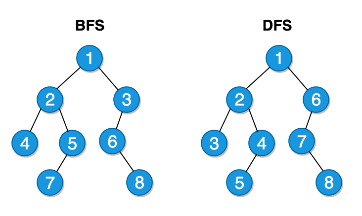

# Graph Algorithms in C++

## Introduction

This repository houses the implementation of two fundamental graph traversal algorithms: Breadth-First Search (BFS) and Depth-First Search (DFS), programmed in C++. These algorithms are vital tools in the realm of computer science and have applications in various domains, including data analysis, artificial intelligence, and game development.

## Implemented Algorithms

### Breadth-First Search (BFS)

**Breadth-First Search (BFS)** is a powerful algorithm employed for traversing and searching tree or graph data structures. It initiates its journey from the root node and systematically explores all neighboring nodes at the current level before delving deeper. BFS finds its usage in numerous scenarios, such as determining the shortest path in unweighted graphs and network analysis.

### Depth-First Search (DFS)

**Depth-First Search (DFS)** is another critical graph traversal algorithm that adopts a different approach. Instead of covering breadth like BFS, DFS dives as far as possible along a single branch before backtracking. This algorithm is handy for tasks like topological sorting, cycle detection, and puzzle-solving, including mazes. DFS finds its applications in artificial intelligence, data mining, and more.

These algorithms provide versatile tools for analyzing and navigating complex graphs and trees in various applications.
